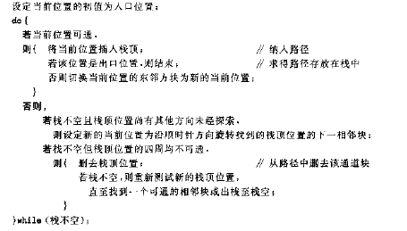
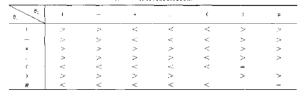
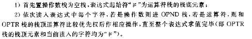

#栈应用
#####数制转换
每一位数字产生顺序与输出顺序相反。

	void conversion() /* 算法3.1 */
	 { /* 对于输入的任意一个非负十进制整数，打印输出与其等值的八进制数 */
	   SqStack s;
	   unsigned n; /* 非负整数 */
	   SElemType e;
	   InitStack(&s); /* 初始化栈 */
	   printf("n(>=0)=");
	   scanf("%u",&n); /* 输入非负十进制整数n */
	   while(n) /* 当n不等于0 */
	   {
	     Push(&s,n%8); /* 入栈n除以8的余数(8进制的低位) */
	     n=n/8;
	   }
	   while(!StackEmpty(s)) /* 当栈不空 */
	   {
	     Pop(&s,&e); /* 弹出栈顶元素且赋值给e */
	     printf("%d",e); /* 输出e */
	   }
	   printf("\n");
	 }

#####括号匹配检验
弄清楚输入输出！！！

输入：字符串

输出：错误信息或者NULL

判断行中（），[]是否匹配

	void check()
	 { /* 对于输入的任意一个字符串，检验括号是否配对 */
	   SqStack s;
	   SElemType ch[80],*p,e;
	   if(InitStack(&s)) /* 初始化栈成功 */
	   {
	     printf("请输入表达式\n");
	     gets(ch);
	     p=ch;
	     while(*p) /* 没到串尾 */
	       switch(*p)
	       {
	         case '(':
	         case '[':Push(&s,*p++);
	                  break; /* 左括号入栈，且p++ */
	         case ')':
	         case ']':if(!StackEmpty(s)) /* 栈不空 */
	                  {
	                    Pop(&s,&e); /* 弹出栈顶元素 */
	                    if(*p==')'&&e!='('||*p==']'&&e!='[') /* 弹出的栈顶元素与*p不配对 */
	                    {
	                      printf("左右括号不配对\n");
	                      exit(ERROR);
	                    }
	                    else
	                    {
	                      p++;
	                      break; /* 跳出switch语句 */
	                    }
	                  }
	                  else /* 栈空 */
	                  {
	                    printf("缺乏左括号\n");
	                    exit(ERROR);
	                  }
	         default: p++; /* 其它字符不处理，指针向后移 */
	       }
	       if(StackEmpty(s)) /* 字符串结束时栈空 */
	         printf("括号匹配\n");
	       else
	         printf("缺乏右括号\n");
	   }
	 }

#####行编辑
输入字符，不为换行或者结束，输入栈中；如果为退格符#，删除栈顶元素；如果为退行符@，清空栈；如果换行，由缓存区输入用户数据区。

输入缓存区数据以行为单位！边界条件，最后一行可能没有换行符但是直接
结束。

	 Status copy(SElemType c)
	 { /* 将字符c送至fp所指的文件中 */
	   fputc(c,fp);
	   return OK;
	 }
	
	 void LineEdit()
	 { /* 利用字符栈s，从终端接收一行并送至调用过程的数据区。算法3.2 */
	   SqStack s;
	   char ch,c;
	   InitStack(&s);
	   printf("请输入一个文本文件,^Z结束输入:\n");
	   ch=getchar();
	   while(ch!=EOF)
	   { /* EOF为^Z键，全文结束符 */
	     while(ch!=EOF&&ch!='\n')
	     {
	       switch(ch)
	       {
	         case '#':Pop(&s,&c);
	                  break; /* 仅当栈非空时退栈 */
	         case '@':ClearStack(&s);
	                  break; /* 重置s为空栈 */
	         default :Push(&s,ch); /* 有效字符进栈 */
	       }
	       ch=getchar(); /* 从终端接收下一个字符 */
	     }
	     StackTraverse(s,copy); /* 将从栈底到栈顶的栈内字符传送至文件 */
	     ClearStack(&s); /* 重置s为空栈 */
	     fputc('\n',fp);
	     if(ch!=EOF)
	       ch=getchar();
	   }
	   DestroyStack(&s);
	 }
	
	 void main()
	 {
	   fp=fopen("ED.DAT","w"); /* 在当前目录下建立ED.DAT文件，用于写数据， */
	   if(fp)                  /* 如已有同名文件则先删除原文件 */
	   {
	     LineEdit();
	     fclose(fp); /* 关闭fp所指的文件 */
	   }
	   else
	     printf("建立文件失败!\n");
	 }

#####穷解迷宫
思路：

注意可通，3个条件，可通，不在当前路径上，先前未纳入过路径（不可通被删除）
迷宫数据存储，矩阵。

	 typedef struct /* 迷宫坐标位置类型 */
	 {
	   int x; /* 行值 */
	   int y; /* 列值 */
	 }PosType;
	
	 #define MAXLENGTH 25 /* 设迷宫的最大行列为25 */
	 typedef int MazeType[MAXLENGTH][MAXLENGTH]; /* 迷宫数组[行][列] */
	
	 /* 全局变量 */
	 MazeType m; /* 迷宫数组 */
	 int curstep=1; /* 当前足迹,初值为1 */
	
	 typedef struct /* 栈的元素类型 */
	 {
	   int ord; /* 通道块在路径上的＂序号＂ */
	   PosType seat; /* 通道块在迷宫中的＂坐标位置＂ */
	   int di; /* 从此通道块走向下一通道块的＂方向＂(0～3表示东～北) */
	 }SElemType;
	
	 /* 定义墙元素值为0,可通过路径为1,不能通过路径为-1,通过路径为足迹 */
	
	 Status Pass(PosType b)
	 { /* 当迷宫m的b点的序号为1(可通过路径)，return OK; 否则，return ERROR。 */
	   if(m[b.x][b.y]==1)
	     return OK;
	   else
	     return ERROR;
	 }
	
	 void FootPrint(PosType a)
	 { /* 使迷宫m的a点的序号变为足迹(curstep) */
	   m[a.x][a.y]=curstep;
	 }
	
	 PosType NextPos(PosType c,int di)
	 { /* 根据当前位置及移动方向，返回下一位置 */
	   PosType direc[4]={{0,1},{1,0},{0,-1},{-1,0}}; /* {行增量,列增量} */
	   /* 移动方向,依次为东南西北 */
	   c.x+=direc[di].x;
	   c.y+=direc[di].y;
	   return c;
	 }
	
	 void MarkPrint(PosType b)
	 { /* 使迷宫m的b点的序号变为-1(不能通过的路径) */
	   m[b.x][b.y]=-1;
	 }
	
	 Status MazePath(PosType start,PosType end) /* 算法3.3 */
	 { /* 若迷宫maze中存在从入口start到出口end的通道，则求得一条 */
	   /* 存放在栈中(从栈底到栈顶)，并返回TRUE；否则返回FALSE */
	   SqStack S;
	   PosType curpos;
	   SElemType e;
	   InitStack(&S);
	   curpos=start;
	   do
	   {
	     if(Pass(curpos))
	     { /* 当前位置可以通过，即是未曾走到过的通道块 */
	       FootPrint(curpos); /* 留下足迹 */
	       e.ord=curstep;
	       e.seat.x=curpos.x;
	       e.seat.y=curpos.y;
	       e.di=0;
	       Push(&S,e); /* 入栈当前位置及状态 */
	       curstep++; /* 足迹加1 */
	       if(curpos.x==end.x&&curpos.y==end.y) /* 到达终点(出口) */
	         return TRUE;
	       curpos=NextPos(curpos,e.di);
	     }
	     else
	     { /* 当前位置不能通过 */
	       if(!StackEmpty(S))
	       {
	         Pop(&S,&e); /* 退栈到前一位置 */
	         curstep--;
	         while(e.di==3&&!StackEmpty(S)) /* 前一位置处于最后一个方向(北) */
	         {
	           MarkPrint(e.seat); /* 留下不能通过的标记(-1) */
	           Pop(&S,&e); /* 退回一步 */
	           curstep--;
	         }
	         if(e.di<3) /* 没到最后一个方向(北) */
	         {
	           e.di++; /* 换下一个方向探索 */
	           Push(&S,e);
	           curstep++;
	           curpos=NextPos(e.seat,e.di); /* 设定当前位置是该新方向上的相邻块 */
	         }
	       }
	     }
	   }while(!StackEmpty(S));
	   return FALSE;
	 }
	
	 void Print(int x,int y)
	 { /* 输出迷宫的解 */
	   int i,j;
	   for(i=0;i<x;i++)
	   {
	     for(j=0;j<y;j++)
	       printf("%3d",m[i][j]);
	     printf("\n");
	   }
	 }
	
	 void main()
	 {
	   PosType begin,end;
	   int i,j,x,y,x1,y1;
	   printf("请输入迷宫的行数,列数(包括外墙)：");
	   scanf("%d,%d",&x,&y);
	   for(i=0;i<x;i++) /* 定义周边值为0(同墙) */
	   {
	     m[0][i]=0; /* 行周边 */
	     m[x-1][i]=0;
	   }
	   for(j=1;j<y-1;j++)
	   {
	     m[j][0]=0; /* 列周边 */
	     m[j][y-1]=0;
	   }
	   for(i=1;i<x-1;i++)
	     for(j=1;j<y-1;j++)
	       m[i][j]=1; /* 定义通道初值为1 */
	   printf("请输入迷宫内墙单元数：");
	   scanf("%d",&j);
	   printf("请依次输入迷宫内墙每个单元的行数,列数：\n");
	   for(i=1;i<=j;i++)
	   {
	     scanf("%d,%d",&x1,&y1);
	     m[x1][y1]=0; /* 定义墙的值为0 */
	   }
	   printf("迷宫结构如下:\n");
	   Print(x,y);
	   printf("请输入起点的行数,列数：");
	   scanf("%d,%d",&begin.x,&begin.y);
	   printf("请输入终点的行数,列数：");
	   scanf("%d,%d",&end.x,&end.y);
	   if(MazePath(begin,end)) /* 求得一条通路 */
	   {
	     printf("此迷宫从入口到出口的一条路径如下:\n");
	     Print(x,y); /* 输出此通路 */
	   }
	   else
	     printf("此迷宫没有从入口到出口的路径\n");
	 }

#####表达式求值，计算器
算符优先法，根据运算优先关系来进行求解。

表达式的组成
* 操作数operand，变量或者常量
* 运算符operator，算数，关系，逻辑
* 界限符delimiter，左右括号，表达式结束符#。！！！结束的标志

相继出现算符优先级关系：大，小，等

对算符关系的定义：

实现思路：

设置两个栈分别村塾运算符和运算数（结果）

基本思想：

代码：

	 SElemType Precede(SElemType t1,SElemType t2)
	 { /* 根据教科书表3.1，判断两符号的优先关系 */
	   SElemType f;
	   switch(t2)
	   {
	     case '+':
	     case '-':if(t1=='('||t1=='#')
	                f='<';
	              else
	                f='>';
	              break;
	     case '*':
	     case '/':if(t1=='*'||t1=='/'||t1==')')
	                f='>';
	              else
	                f='<';
	              break;
	     case '(':if(t1==')')
	              {
	                printf("ERROR1\n");
	                exit(ERROR);
	              }
	              else
	                f='<';
	              break;
	     case ')':switch(t1)
	              {
	                case '(':f='=';
	                         break;
	                case '#':printf("ERROR2\n");
	                         exit(ERROR);
	                default: f='>';
	              }
	              break;
	     case '#':switch(t1)
	              {
	                case '#':f='=';
	                         break;
	                case '(':printf("ERROR3\n");
	                         exit(ERROR);
	                default: f='>';
	              }
	   }
	   return f;
	 }
	
	 Status In(SElemType c)
	 { /* 判断c是否为运算符 */
	   switch(c)
	   {
	     case'+':
	     case'-':
	     case'*':
	     case'/':
	     case'(':
	     case')':
	     case'#':return TRUE;
	     default:return FALSE;
	   }
	 }
	
	 SElemType Operate(SElemType a,SElemType theta,SElemType b)
	 {
	   SElemType c;
	   a=a-48;
	   b=b-48;
	   switch(theta)
	   {
	     case'+':c=a+b+48;
	             break;
	     case'-':c=a-b+48;
	             break;
	     case'*':c=a*b+48;
	             break;
	     case'/':c=a/b+48;
	   }
	   return c;
	 }
	
	 SElemType EvaluateExpression() /* 算法3.4 */
	 { /* 算术表达式求值的算符优先算法。设OPTR和OPND分别为运算符栈和运算数栈 */
	   SqStack OPTR,OPND;
	   SElemType a,b,c,x,theta;
	   InitStack(&OPTR);
	   Push(&OPTR,'#');
	   InitStack(&OPND);
	   c=getchar();
	   GetTop(OPTR,&x);
	   while(c!='#'||x!='#')
	   {
	     if(In(c)) /* 是7种运算符之一 */
	       switch(Precede(x,c))
	       {
	         case'<':Push(&OPTR,c); /* 栈顶元素优先权低 */
	                 c=getchar();
	                 break;
	         case'=':Pop(&OPTR,&x); /* 脱括号并接收下一字符 */
	                 c=getchar();
	                 break;
	         case'>':Pop(&OPTR,&theta); /* 退栈并将运算结果入栈 */
			 Pop(&OPND,&b);
	                 Pop(&OPND,&a);
	                 Push(&OPND,Operate(a,theta,b));
	                 break;
	       }
	     else if(c>='0'&&c<='9') /* c是操作数 */
	     {
	       Push(&OPND,c);
	       c=getchar();
	     }
	     else /* c是非法字符 */
	     {
	       printf("ERROR4\n");
	       exit(ERROR);
	     }
	     GetTop(OPTR,&x);
	   }
	   GetTop(OPND,&x);
	   return x;
	 }
	
	 void main()
	 {
	   printf("请输入算术表达式（中间值及最终结果要在0～9之间），并以#结束\n");
	   printf("%c\n",EvaluateExpression());
	 }

