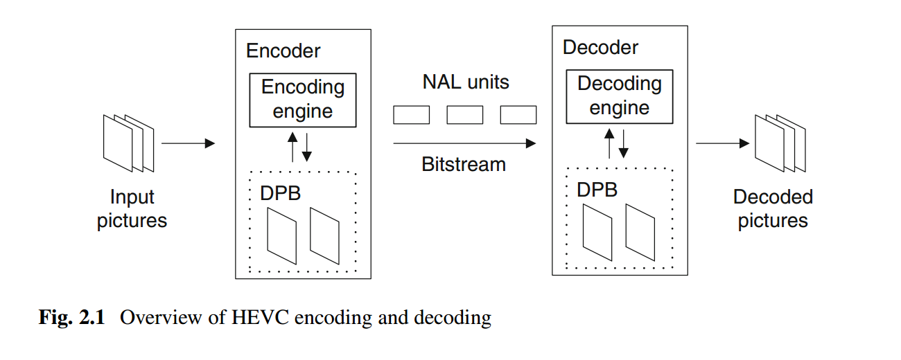
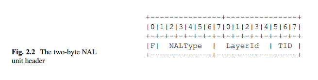

#HEVC High-Level Syntax

##Abstract

bitstream

    组成--NALu
        包含
            1. parameter sets--carry high-level information,整个序列，或者图片的子集
            2. coded samples, in the form of slices that belong to one of the various       
                picture types
                    type
                        可被丢弃
                        位置信息--random access
                slice
                    包含的信息：管理解码图片
                            what previous pictures to keep
                            in which order they are to be output
            3. SEI
                aids the decoding process，
                providing hints about how best to display the video

 high-level syntax

    描述--syntax elements

    功能
        describe the structure of the bitstream 
        provide information that applies to pictures or to coded block regions within a picture

    重要性：
        broadly applicable
        flexible
        robust to data losses
        highly capable of providing useful information to decoders and receiving systems

##1. Introduction

high-level syntax

    组成
        structure of the bitstream
        signaling of high-level information--作用于bitstream的slices或pictures
        high-level tool decoding processes associated with the syntax elements
            -reference picture management
            -output of decoded pictures

编码解码流程

Input pictures--endocer--bitstream(NALu)--decoder--decoded pictures

Input pictures--slice

    相互独立，携带的信息独立解码
    组成：
        slice segments
            第一个：independent slice segment-- independent of other slice segments
            subsequent：  dependent slice segments--depend on previous slice segments

            组成：
                slice segment header--independent
                    control information，
                slice segment data
                    coded samples

NALu

    组成
        NAL unit header-first two bytes
        payload data--rest
    内容
        parameter sets--控制信息
        coded samples

encoder,decoder

    组成部分：DPB--decoded picture buffer
    作用：
        storing pictures --as reference pictures
            generate prediction signals

##2. The NAL Unit Header and the HEVC Bitstream

NALu分类

    video coding layer (VCL) NAL units
        carries one slice segment of coded picture data
    non-VCL NAL units
        contain control information that typically relates to multiple coded pictures

HEVC access unit

    One coded picture + associated non-VCL NAL units
    VCL NALu is necessary, non-VCL NAL units not necessary
###2.1 The NAL Unit Header

设计目的： 
    
    方便解析内容
    类型
    属于什么layer，temporal sub-layer
组成
    第一个bit--设为0

        标志位，防止非NAL header被理解为NAL header
    6个bits--type value,VCL, non-VCL各32个      **有多少，如何分配**
    6个bits--layer identifier，属于哪一个layer
        发展：
            初始全部设为0
            升级,layered extensions
                 spatial scalable layer
                 quality scalable layer
                 scalable multiview layer
                 base layer全部设为0
            兼容
                base layer全部设为0
                老版本丢弃所有高层

    3个bits--temporal identifier，7个值，1个被禁用
        access unit belongs to one temporal sub-layer--temporal-ID
        --all VCL NAL units belonging to the same access unit must have the same temporal ID 

referencing structures 

    slice type--I,P,B
    reference relationship
    decoding order- order in which the pictures are decoded
        ==order as pictures are included in the bitstream 
        ==order as the pictures are encoded
        sometimes referred to as bitstream order
        特例：
            allow reordering in transmission but have to be reordered before decoding
    output order
        order in which pictures are output from the DPB
        ==order in which the pictures are generally intended to be displayed
        
        ouput is necessary, display is optional--optional picture output flag in slice header
            output->re-encoded without being displayed
        区分output和display原因：
            定义标准的范围，output后，如何展示，post-processing不在标准之内

        表示：
            bitstream中的POC( picture order count)

        与coded video sequence (CVS）的关系：
            每个CVS中独立决定output order
            给定CVS，FIFO，当前CVS的order总在下一个之前
            给定CVS,POC逐渐递增，FSLL,first small last large
            不同CVS之间POC大小关系无关

解码过程：

    lower temporal sublayer不会依赖higher temporal sub-layer的信息 
        sub-bitstream extraction
            done by discarding all NAL units which have a temporal ID higher 
            than a target temporal ID value called HighestTid

###2.2 VCL NAL Unit Types

####2.2.1 IRAP Pictures

####2.2.2 Leading and Trailing Pictures

####2.2.3 Temporal Sub-layer Access (TSA) Pictures

####2.2.4 Step-wise Temporal Sub-layer Access (STSA) Pictures

####2.2.5 Ordinary Trailing (TRAIL) Pictures

####2.2.6 Instantaneous Decoding Refresh (IDR) Pictures

####2.2.7 Clean Random Access (CRA) Pictures

####2.2.8 Random Access Decodable Leading (RADL) and Random Access Skipped Leading (RASL) Pictures

####2.2.9 Splicing and Broken Link Access (BLA) Pictures

####2.2.10 Sub-layer Reference and Sub-layer Non-reference Pictures

####2.2.11 Reserved and Unspecified VCL NAL Unit Types

###2.3 Coded Video Sequences and Bitstream Conformance

###2.4 Non-VCL NAL Unit Types

##3. Parameter Sets

##4. Picture Buffering Management

##5. Video Usability Information (VUI) and Supplemental Enhancement Information (SEI)

##6. Hypothetical Reference Decoder (HRD)

