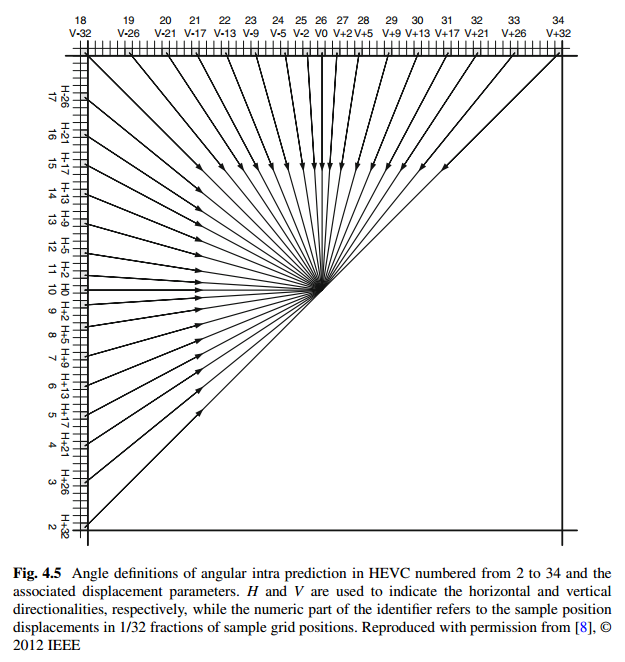

# Intra-Picture Prediction in HEVC

## Abstract
基本步骤

    reference sample array construction
    sample prediction
    post-processing

要求

    computational requirements in both the encoder and decoder

mode--scenario

    angular prediction--objects with directional structures
    planar prediction and DC prediction modes--smooth image areas

## 1 Introduction

分类：

    angular prediction(2-34)--objects with directional structures
    planar prediction(0) and DC prediction(1) modes--smooth image areas
    总mode：35

资源：

    reference samples from the adjacent reconstructed blocks
    transform block size

提升性能

    different filtering alternatives for pre-processing the reference samples
    post-processing step to refine the sample surface continuity on the block boundaries
## 2 Reference Sample Generation

intra实现方式

    外推样本值

相比于264的区别：

     introduces a reference sample substitution process
     -use the complete set of intra prediction modes regardless of the availability of the neighboring 
     reference samples，264只允许DC prediction

     adaptive filtering process that can pre-filter the reference samples  
        to increase the diversity of the available predictors
        according to
            intra prediction mode
            block size
            directionality

### 2.1 Reference Sample Substitution

作用：

    产生更多有用的数据

某些reference samples不能用于预测的原因：

    samples outside of the picture
    slice or tile are considered unavailable for prediction

特殊情况：

    所有reference sample都不可用--substituted by a nominal average sample value for a given bit depth 
    至少一个可用：in clock-wise direction填充

        过程：
        纵向最下方如不可用，被顺时针的第一个可用值替代
        纵向每个不可用值被下方值替代
        横向每个不可用值被左方的值替代

### 2.2 Filtering Process of Reference Samples

目的：

    improve visual appearance of the prediction block
    -by avoiding steps in the values of RS that could potentially generate unwanted directional edges 

是否需要用
* prediction mode
* size of the prediction block

1. DC prediction，4 * 4--smoothing filter is switched off
2. 8 * 8，diagonal directions--apply
3. 16 * 16, except the near-horizontal and near-vertical directions--apply
4. 32 * 32, except exactly vertical and exactly horizontal directions--apply

怎么用
一般情况
* three-tap [1 2 1]/4 smoothing filter
* $p[-1][2N-1]$ and $p[2N-1][-1]$ are not modified
* (two neighborhood with 1 and self value with 2,+2) >>2

特例
block size 32*32 and the reference samples are found to be sufficiently flat:
--reference samples are generated by applying linear interpolation between the three corner reference samples, $p[-1][63]$,$p[-1][-1]$,$p[63][-1]$

实现：
* 判断flatness： 
    $| p [-1][-1] + p[2N][-1]- 2p[N-1][-1] | < (1 << (b - 5))$
    $| p [-1][-1] + p[-1][2N-1]- 2p[-1][N-1] | < (1 << (b - 5))$
    b--sample bit depth
* 满足条件的插值：
    $p[-1][y]=((63-y)*p[-1][-1]+(y+1)*p[-1][63]+32)>>6$
    $p[x][-1]=((63-x)*p[-1][-1]+(x+1)*p[63][-1]+32)>>6$
    for $x=0...62$ and $y=0...62$

描述：
* strong intra smoothing as it substitutes nearly all the original reference samples with interpolated ones

目的：
* remove some blocking and contouring artifacts visible on extremely smooth image areas 
* it can be selectively turned on or off by the syntax element ***strong_intra_smoothing_enabled_flag*** in a sequence parameter set

## 3 Intra Sample Prediction

多种模式：
* 支持不同场景的高效预测
* angular intra prediction--different directional structures 
* Planar and DC predictions 
    * image areas with smooth and gradually changing content
    * creating “neutral” prediction blocks with no high frequency components for complex textures，不能被angular intra prediction很好表示得blocks

post-filtering：
* enhance continuity of the prediction signal at block boundaries
### 3.1 Angular Prediction
目的

约束
* encoding complexity
* coding efficiency
    * consistent across different block sizes and prediction directions

方向（参数）的选择：
* trade-off between encoding complexity and coding efficiency

空间：
* block sizes，4,8,16,32
* direction：33
* total 132

#### 3.1.1 Angle Definitions

总量：33
间隔，单位：1/32的准确性
问题分布：vertical，horizontal的问题更多
解决：以vertical，horizontal为基础，加上小的位移参数displacement parameters，常见pattern参数小，不常见参数大，方向变为对角型

#### 3.1.2 Reference Row Extension for the Negative Prediction Directions

#### 3.1.3 Sample Prediction for Angular Prediction Modes

### 3.2 DC Prediction

### 3.3 Planar Prediction

### 3.4 Post-processing for Predicted Samples

## 4 Intra Mode Coding

### 4.1 Prediction of Luma Intra Mode

### 4.2 Derived Mode for Chroma Intra Prediction

### 4.3 Syntax Design for Intra Mode Coding

## 5 Encoding Algorithms

## 6 Coding Efficiency and Decoder Complexity

### 6.1 Coding Efficiency

### 6.2 Decoder Complexity

## 7 Main Still Picture Profile and Its Applications

## 8 Summary of Differences from H.264/AVC