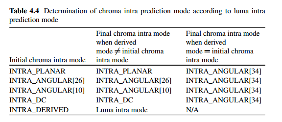

# Intra-Picture Prediction in HEVC

## Abstract
基本步骤

    reference sample array construction
    sample prediction
    post-processing

要求

    computational requirements in both the encoder and decoder

mode--scenario

    angular prediction--objects with directional structures
    planar prediction and DC prediction modes--smooth image areas

## 1 Introduction

分类：

    angular prediction(2-34)--objects with directional structures
    planar prediction(0) and DC prediction(1) modes--smooth image areas
    总mode：35

资源：

    reference samples from the adjacent reconstructed blocks
    transform block size

提升性能

    different filtering alternatives for pre-processing the reference samples
    post-processing step to refine the sample surface continuity on the block boundaries
## 2 Reference Sample Generation

intra实现方式

    外推样本值

相比于264的区别：

     introduces a reference sample substitution process
     -use the complete set of intra prediction modes regardless of the availability of the neighboring 
     reference samples，264只允许DC prediction

     adaptive filtering process that can pre-filter the reference samples  
        to increase the diversity of the available predictors
        according to
            intra prediction mode
            block size
            directionality

### 2.1 Reference Sample Substitution

作用：

    产生更多有用的数据

某些reference samples不能用于预测的原因：

    samples outside of the picture
    slice or tile are considered unavailable for prediction

特殊情况：

    所有reference sample都不可用--substituted by a nominal average sample value for a given bit depth 
    至少一个可用：in clock-wise direction填充

        过程：
        纵向最下方如不可用，被顺时针的第一个可用值替代
        纵向每个不可用值被下方值替代
        横向每个不可用值被左方的值替代

### 2.2 Filtering Process of Reference Samples

目的：

    improve visual appearance of the prediction block
    -by avoiding steps in the values of RS that could potentially generate unwanted directional edges 

是否需要用
* prediction mode
* size of the prediction block

1. DC prediction，4 * 4--smoothing filter is switched off
2. 8 * 8，diagonal directions--apply
3. 16 * 16, except the near-horizontal and near-vertical directions--apply
4. 32 * 32, except exactly vertical and exactly horizontal directions--apply

怎么用
一般情况
* three-tap [1 2 1]/4 smoothing filter
* $p[-1][2N-1]$ and $p[2N-1][-1]$ are not modified
* (two neighborhood with 1 and self value with 2,+2) >>2

特例
block size 32*32 and the reference samples are found to be sufficiently flat:
--reference samples are generated by applying linear interpolation between the three corner reference samples, $p[-1][63]$,$p[-1][-1]$,$p[63][-1]$

实现：
* 判断flatness： 
    $| p [-1][-1] + p[2N][-1]- 2p[N-1][-1] | < (1 << (b - 5))$
    $| p [-1][-1] + p[-1][2N-1]- 2p[-1][N-1] | < (1 << (b - 5))$
    b--sample bit depth
* 满足条件的插值：
    $p[-1][y]=((63-y)*p[-1][-1]+(y+1)*p[-1][63]+32)>>6$
    $p[x][-1]=((63-x)*p[-1][-1]+(x+1)*p[63][-1]+32)>>6$
    for $x=0...62$ and $y=0...62$

描述：
* strong intra smoothing as it substitutes nearly all the original reference samples with interpolated ones

目的：
* remove some blocking and contouring artifacts visible on extremely smooth image areas 
* it can be selectively turned on or off by the syntax element ***strong_intra_smoothing_enabled_flag*** in a sequence parameter set

## 3 Intra Sample Prediction

多种模式：
* 支持不同场景的高效预测
* angular intra prediction--different directional structures 
* Planar and DC predictions 
    * image areas with smooth and gradually changing content
    * creating “neutral” prediction blocks with no high frequency components for complex textures，不能被angular intra prediction很好表示得blocks

post-filtering：
* enhance continuity of the prediction signal at block boundaries
### 3.1 Angular Prediction
目的

约束
* encoding complexity
* coding efficiency
    * consistent across different block sizes and prediction directions

方向（参数）的选择：
* trade-off between encoding complexity and coding efficiency

空间：
* block sizes，4,8,16,32
* direction：33
* total 132

#### 3.1.1 Angle Definitions

总量：33
间隔，单位：1/32的准确性
问题分布：vertical，horizontal的问题更多
解决：以vertical，horizontal为基础，加上小的位移参数displacement parameters，常见pattern参数小，不常见参数大，方向变为对角型

#### 3.1.2 Reference Row Extension for the Negative Prediction Directions

#### 3.1.3 Sample Prediction for Angular Prediction Modes

### 3.2 DC Prediction

方法：
预测值为一个常数，reference sample的一个均值

后续处理：
light filter：soften the left and above edges of the block
### 3.3 Planar Prediction

angular的缺点：
平滑地区产生等高线

方法：
* 计算horizontal prediction和vertical prediction
* 平均

计算方式：
$$p[x][y]=(p_h[x][y]+p_v[x][y]+N)>>(log_2(N)+1)$$
右移，除法变为平均！
horizontal prediction $p_h[x][y]$ :  $p_h[x][y]=(N-1-x)*p[-1][y]+(x+1)*p[N][-1]$
vertical prediction $p_v[x][y]$ : $p_v[x][y]=(N-1-y)*p[x][-1]+(y+1)*p[-1][N]$

### 3.4 Post-processing for Predicted Samples

* 问题，场景：

部分情况下prediction modes can generate discontinuities for the predicted sample values on the boundaries of the prediction blocks

* 分布
    * boundaries of the prediction blocks
    * DC prediction
        * occur on both top and left boundary of the block--全部为1个值，中间不会有
    * directly vertical angular predictions
        *  left boundary of the block
        * leftmost column of predicted samples replicate the value of the leftmost reference sample above the block.
    * directly horizontal angular predictions
        *  top edge of the block
    
* 解决
    * 边界的预测值被滤波后的值替换
    * 适用情况：
        * 上述三种modes
        * block size is smaller than 32 * 32
    * 次要目的
        balance between coding efficiency and complexity
    * 操作对象
        luma component， for chroma components tends to be very smooth
    
    * 具体做法
        * exactly vertical direction
            $p[0][y]=p[0][y]+((p[-1][y]-p[-1][-1])>>1)$ for $y=0...N-1$
        * exactly horizontal direction
        * DC prediction
            * $p[0][0]$
                three-tap [1 2 1]/4 smoothing filter
                $p[0][0]=(p[-1][0]+2*dcVal+p[0][-1]+2)>>2$
            * other
                two-tap [3 1]/4 smoothing filter
                $p[x][0]=(p[x][-1]+3*dcVal+2)>>2$ for $x=1..N-1$
                $p[0][y]=(p[-1][y]+3*dcVal+2)>>2$ for $y=1..N-1$
## 4 Intra Mode Coding

分类：按操作对象

    luma--3种可选模式
    chorma--derived mode
    语法设计
    
* 变量对象
    * $MPM$
    * mode number 
        * luma
        * chorma
    * $SMPM$--sorted
    * $prev\_intra\_luma\_pred\_flag$,实际结果是否在$SMPM$中
    * $mpm\_idx$,若在其中，索引
    * $rem\_intra\_luma\_pred\_flag$,不在其中，指出为多少，一共32种，依据有序性进行计算
### 4.1 Prediction of Luma Intra Mode

基于35种总可能情况，周围情况决定3种最可能情况
* 周围：左(A)，上(B)

过程：
* A, B不为intra coded？coded with pulse code modulation (PCM) mode？--越界B被视为DC mode
    * DC mode
    * A!=B：
        * most probable modes $MPM[0]=A$ and $MPM[1]=B$,
            * If neither of A or B is planar mode, $MPM[2]$ is set to planar mode
            * Otherwise, if neither of A or B is DC mode, $MPM[2]$ is set to DC mode
            * Otherwise (one of the two most probable modes is planar and the other is DC), $MPM[2]$ is set equal to angular mode 26 (directly vertical).
    * A==B：
        * 均不是angular modes--DC, planar
            * 1,2,3==planar mode, DC mode and angular mode 26
        * 是angular modes：
            * $MPM[0]=A$
            * $MPM[1]=2+((A-2-1+32)\%32)$
            * $MPM[2]=2+((A-2+1)\%32)$

* 根据mode number，升序排序，形成有序集合
* current intra prediction mode==$MPM[i]$ ?
    * only the index in the set is transmitted to the decoder
    * a 5-bit CABAC bypassed codeword is used to specify the selected mode outside of the set of most probable modes as the number of modes outside of the set is equal to 32；mode number设为32，另外传输
### 4.2 Derived Mode for Chroma Intra Prediction

* 引入依据：
    * 颜色结构跟随亮度结构--structures in the chroma signal follow those of the luma
    * 增加颜色方向性，使得颜色和亮度的编码模式一致
* 总共编码模式：
    * planar--INTRA_PLANAR
    * angular 26 (directly vertical)--INTRA_ANGULAR[26]
    * angular 10 (directly horizontal)--INTRA_ANGULAR[10]
    * DC--INTRA_DC
    * derived mode--INTRA_DERIVED 
* 初始模式和最终模式
    * 依据derived mode是否等于初始模式判断最终模式
        * 不等：保持初始模式
        * 等于：全部变为 INTRA_ANGULAR[34]
        

### 4.3 Syntax Design for Intra Mode Coding

具体实现，参见前面变量处
注意计算chorma mode时，如果当前$rem\_intra\_luma\_pred\_flag$的值大于或等于$SMPM[i]$那么需要额外+1，最多+3
## 5 Encoding Algorithms

## 6 Coding Efficiency and Decoder Complexity

### 6.1 Coding Efficiency

### 6.2 Decoder Complexity

## 7 Main Still Picture Profile and Its Applications

## 8 Summary of Differences from H.264/AVC